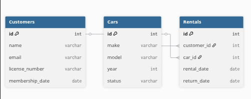

# car-rental-cli-app

#### A simple CLI application for managing a car rental system.
#### Built with with Python, SQLAlchemy ORM,and Alembic for database migrations.
#### By **Samuel Kiplangat**

## Description

This is a cli application for managing  a rental system which is meant to keep track of cars being rented out by a  particular company.It allows customers to register,log in,browse cars,rent cars and return cars
## Screenshot

)

## Features

- User authentication
- Registering a new customer
- logging in 
- browsing available cars
- adding new cars
- viewing rental history

## How to Use

### Requirements

- A computer or a laptop
- A code editor with a terminal
- virtual environment


### Local Development

If you want to run the project locally, you'll need:

- Node.js installed on your computer
- Basic understanding of React JS
- Code editor (VS Code recommended)
- Terminal/Command Line

#### Installation Process

1. Clone this repository using:

   ```bash
   git clone git@github.com:Bett-debug/my-cli-project.git
   ```

   or by downloading a ZIP file of the code.

2. Navigate to the project directory:

   ```bash
   cd my-cli-project
   ```

3. Install the required dependencies:

   ```bash
   pipenv install
   pipenv shell
   ```

4. Run Alembic migrations:
5. Initialize the database and apply migrations.
   ```bash
   alembic upgrade head
   ```

6. Insert seed data with 
   ```bash
   python seed.py
   ```

6. run the cli:
    ```bash
    pipenv run python -m lib.cli
    ```

## Database schema 



## Technologies Used

- Python
- SQLAlchemy ORM
- Alembic
- Database migrations

## The project uses SQLAlchemy with the following tables:

### Customer

- id (Primary Key)
- username (Unique)
- password
- rentals (Relationship with Rental)

### Car

- id (Primary Key)
- make
- model
- available (Boolean)

### Rental

- id (Primary Key)
- customer_id (Foreign Key → Customer)
- car_id (Foreign Key → Car)
- rental_date
- return_date


## Usage Guide

When you run the CLI, you’ll see a menu like this:


--- Car Rental CLI ---
1. Register
2. Login
3. Browse Cars
4. Rent a Car
5. Return a Car
6. Add car
7. Exit


### Example Workflows:

Register → create a new customer account.
Login → authenticate with your username.
Browse Cars → view all available cars.
Rent a Car → select a car to rent (availability is updated).
Return a Car → mark a car as returned.
Add car → add a car to the db
view history → you can view a customers rental history.


### Depandancie I used

SQLAlchemy
→ ORM for database modeling

Alembic
→ database migrations

Tabulate
→ for printing nice tables in the cli


## Support and Contact Details

If you have any questions, suggestions, or need assistance, please contact:

- Email: <samuel.kiplangat@student.moringaschool.com>

## License

MIT License

Copyright &copy; 2025 Samuel Kiplangat

Permission is hereby granted, free of charge, to any person obtaining a copy of this software and associated documentation files (the "Software"), to deal in the Software without restriction, including without limitation the rights to use, copy, modify, merge, publish, distribute, sublicense, and/or sell copies of the Software, and to permit persons to whom the Software is furnished to do so, subject to the following conditions:

The above copyright notice and this permission notice shall be included in all copies or substantial portions of the Software.

THE SOFTWARE IS PROVIDED "AS IS", WITHOUT WARRANTY OF ANY KIND, EXPRESS OR IMPLIED, INCLUDING BUT NOT LIMITED TO THE WARRANTIES OF MERCHANTABILITY, FITNESS FOR A PARTICULAR PURPOSE AND NONINFRINGEMENT. IN NO EVENT SHALL THE AUTHORS OR COPYRIGHT HOLDERS BE LIABLE FOR ANY CLAIM, DAMAGES OR OTHER LIABILITY, WHETHER IN AN ACTION OF CONTRACT, TORT OR OTHERWISE, ARISING FROM, OUT OF OR IN CONNECTION WITH THE SOFTWARE OR THE USE OR OTHER DEALINGS IN THE SOFTWARE.